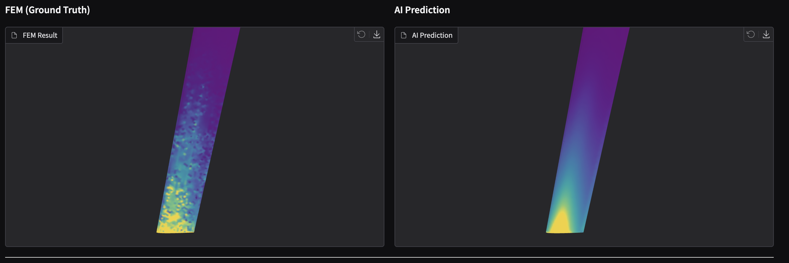

# Deep-FEM-UAV-Wing

**AI-based UAV Wing Structural Analysis Prediction (Surrogate Modeling)**

Predicts stress distribution on drone wings under pressure loading.
Traditional FEM (Finite Element Method) simulations are computationally expensive. This project uses **AI (GNN)** to approximate FEM results in real-time.



> Left: FEM simulation result (Ground Truth) / Right: AI prediction

---

## Pipeline

```
1. Geometry (Blender) → 2. Meshing (Gmsh) → 3. FEM Analysis (CalculiX) → 4. AI Training (PyG) → 5. Real-time Prediction
```

---

## AI Prediction Performance

Trained on 200 cases:

| Metric | Value | Description |
|--------|-------|-------------|
| **MAE** | 0.79 MPa | Average deviation from ground truth |
| **Relative Error** | ~3.3% | Relative to max stress |
| **Overfitting** | None | Generalizes well to unseen geometries |

### Strengths

- **Fast prediction**: FEM takes minutes per case, AI takes seconds
- **Accurate stress distribution**: Captures overall stress patterns well
- **Useful for early design**: Rapid screening of various geometries

### Limitations

| Limitation | Description | Recommendation |
|------------|-------------|----------------|
| **Peak stress underestimation** | AI predicts lower peak values than actual | Use FEM for final safety verification |
| **Training data bounds** | Only reliable within trained geometry range | Verify extreme geometries with FEM |

> **Conclusion**: Average stress prediction is accurate, but stress concentration peaks are underestimated due to GNN's neighborhood averaging characteristic.

---

## Quick Start

### 1. Setup

```bash
python -m venv .venv
source .venv/bin/activate
pip install -r requirements.txt
```

### 2. Run Demo

```bash
python app.py
```

Open `http://127.0.0.1:7860` in browser

---

## Project Structure

```
Deep-FEM-UAV-Wing/
├── app.py                      # Gradio demo (FEM vs AI comparison)
├── blender/                    # Geometry generation scripts
├── src/deep_fem_uav_wing/
│   ├── gnn/                    # GNN model (GraphSAGE)
│   ├── mesh/                   # Mesh generation
│   └── fem/                    # FEM analysis
├── scripts/
│   ├── generate_geometry_dataset.py
│   ├── generate_mesh_dataset.py
│   ├── generate_fem_dataset.py
│   ├── train_gnn.py
│   └── inference_gnn.py
└── data/raw/                   # Generated dataset
```

---

## Dataset Generation (Optional)

To generate your own dataset, additional tools are required:

| Stage | Tool | Installation |
|-------|------|--------------|
| Geometry | Blender | [blender.org](https://www.blender.org/) |
| Meshing | Gmsh | `brew install gmsh` |
| FEM | CalculiX | `brew install calculix-ccx` |
| Training | PyTorch + PyG | `pip install -r requirements-gnn.txt` |

```bash
# 1. Generate 200 geometries
python scripts/generate_geometry_dataset.py --count 200 --seed 42

# 2. Generate meshes
python scripts/generate_mesh_dataset.py --limit 0

# 3. Run FEM analysis
python scripts/generate_fem_dataset.py --limit 0 --pressure 5000

# 4. Train AI model (CUDA required)
python scripts/train_gnn.py

# 5. Run inference
python scripts/inference_gnn.py
```

---

## Tech Stack

- **Geometry**: Blender Python API
- **Meshing**: Gmsh (Tetrahedra)
- **FEM**: CalculiX (Linear Static)
- **AI**: PyTorch Geometric (GraphSAGE)
- **Visualization**: Gradio + trimesh

---

## License

MIT
